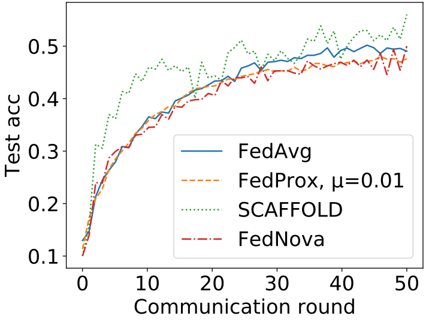
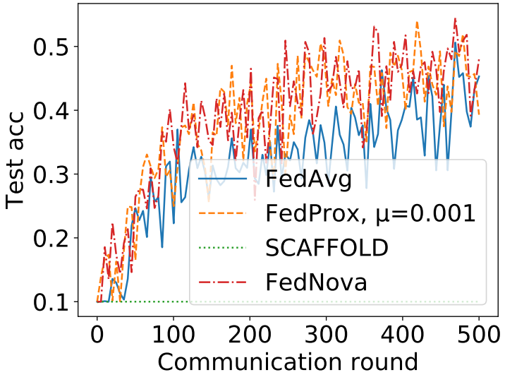
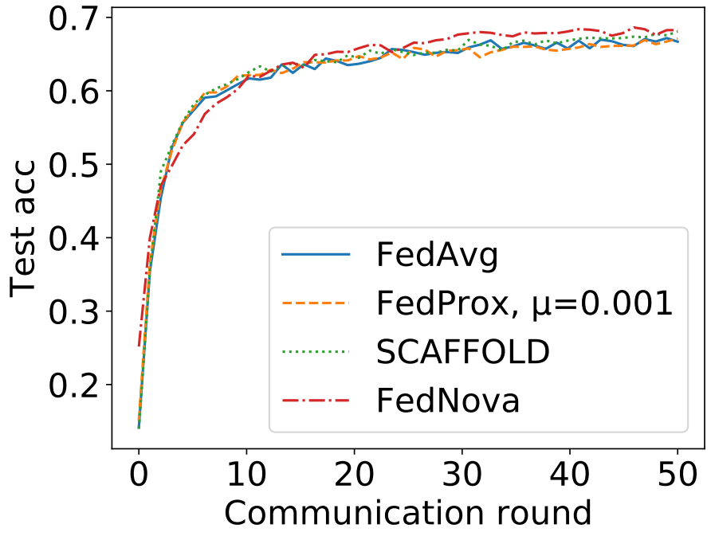
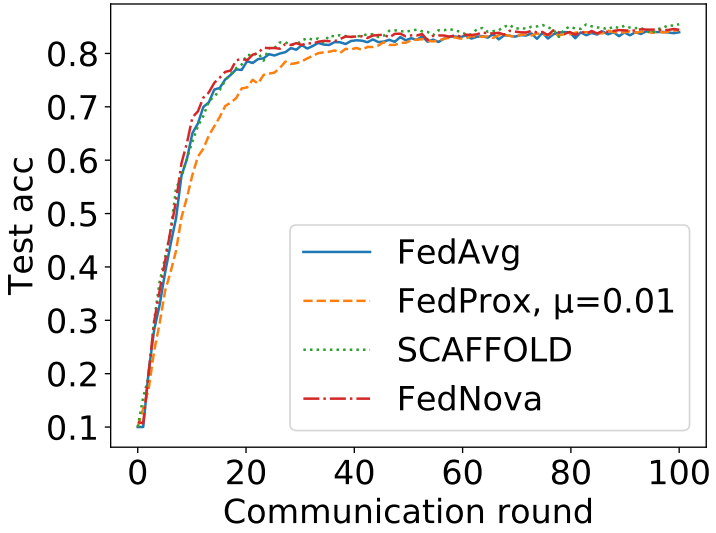
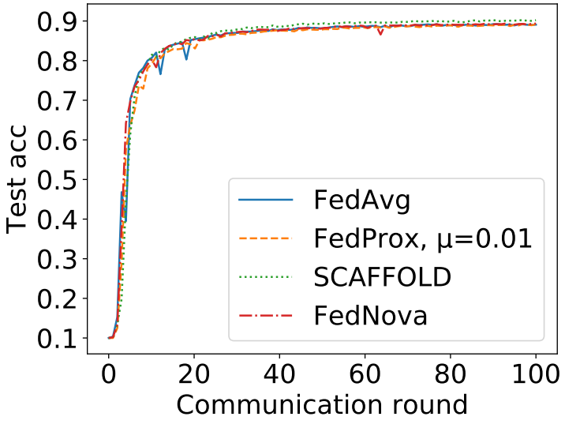
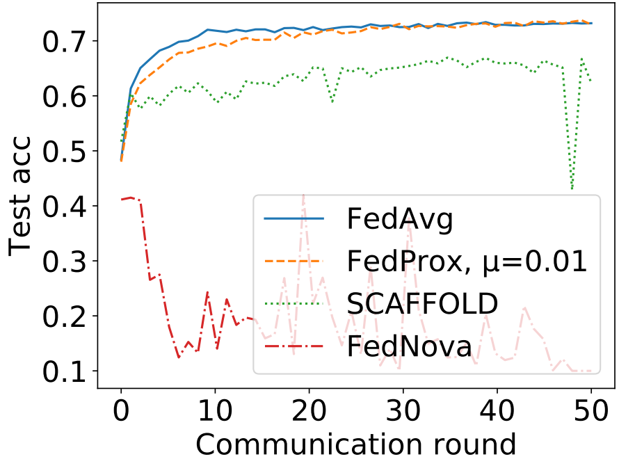
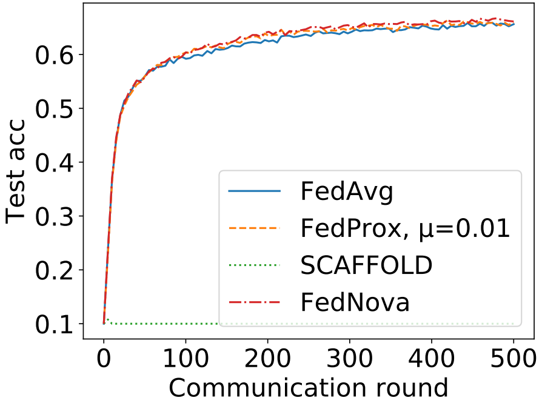

# NIID-Bench
This is the code of paper [Federated Learning on Non-IID Data Silos: An Experimental Study](https://arxiv.org/pdf/2102.02079.pdf).


This code runs a benchmark for federated learning algorithms under non-IID data distribution scenarios. Specifically, we implement 4 federated learning algorithms (FedAvg, FedProx, SCAFFOLD & FedNova), 3 types of non-IID settings (label distribution skew, feature distribution skew & quantity skew) and 9 datasets (MNIST, Cifar-10, Fashion-MNIST, SVHN, Generated 3D dataset, FEMNIST, adult, rcv1, covtype).


## Non-IID Settings
### Label Distribution Skew
* **Quantity-based label imbalance**: each party owns data samples of a fixed number of labels.
* **Distribution-based label imbalance**: each party is allocated a proportion of the samples of each label according to Dirichlet distribution.
### Feature Distribution Skew
* **Noise-based feature imbalance**: We first divide the whole datasetinto multiple parties randomly and equally. For each party, we adddifferent levels of Gaussian noises.
* **Synthetic feature imbalance**: For generated 3D data set, we allocate two parts which are symmetric of(0,0,0) to a subset for each party.
* **Real-world feature imbalance**: For FEMNIST, we divide and assign thewriters (and their characters) into each party randomly and equally.
### Quantity Skew
* While the data distribution may still be consistent amongthe parties, the size of local dataset varies according to Dirichlet distribution.


## Usage
Here is one example to run this code:
```
python experiments.py --model=simple-cnn \
    --dataset=cifar10 \
    --alg=fedprox \
    --lr=0.01 \
    --batch-size=64 \
    --epochs=10 \
    --n_parties=10 \
    --mu=0.01 \
    --rho=0.9 \
    --comm_round=50 \
    --partition=noniid-labeldir \
    --beta=0.5\
    --device='cuda:0'\
    --datadir='./data/' \
    --logdir='./logs/' \
    --noise=0 \
    --sample=1 \
    --init_seed=0
```

| Parameter                      | Description                                 |
| ----------------------------- | ---------------------------------------- |
| `model` | The model architecture. Options: `simple-cnn`, `vgg`, `resnet`, `mlp`. Default = `mlp`. |
| `dataset`      | Dataset to use. Options: `mnist`, `cifar10`, `fmnist`, `svhn`, `generated`, `femnist`, `a9a`, `rcv1`, `covtype`. Default = `mnist`. |
| `alg` | The training algorithm. Options: `fedavg`, `fedprox`, `scaffold`, `fednova`. Default = `fedavg`. |
| `lr` | Learning rate for the local models, default = `0.01`. |
| `batch-size` | Batch size, default = `64`. |
| `epochs` | Number of local training epochs, default = `5`. |
| `n_parties` | Number of parties, default = `2`. |
| `mu` | The proximal term parameter for FedProx, default = `1`. |
| `rho` | The parameter controlling the momentum SGD, default = `0`. |
| `comm_round`    | Number of communication rounds to use, default = `50`. |
| `partition`    | The partition way. Options: `homo`, `noniid-labeldir`, `noniid-#label1` (or 2, 3, ..., which means the fixed number of labels each party owns), `real`, `iid-diff-quantity`. Default = `homo` |
| `beta` | The concentration parameter of the Dirichlet distribution for heterogeneous partition, default = `0.5`. |
| `device` | Specify the device to run the program, default = `cuda:0`. |
| `datadir` | The path of the dataset, default = `./data/`. |
| `logdir` | The path to store the logs, default = `./logs/`. |
| `noise` | Maximum variance of Gaussian noise we add to local party, default = `0`. |
| `sample` | Ratio of parties that participate in each communication round, default = `1`. |
| `init_seed` | The initial seed, default = `0`. |


## Data Partition Map
You can call function `get_partition_dict()` in `experiments.py` to access `net_dataidx_map`. `net_dataidx_map` is a dictionary. Its keys are party ID, and the value of each key is a list containing index of data assigned to this party. For our experiments, we usually set `init_seed=0`. When we repeat experiments of some setting, we change `init_seed` to 1 or 2. The default value of `noise` is 0 unless stated. We list the way to get our data partition as follow.
* **Quantity-based label imbalance**: `partition`=`noniid-#label1`, `noniid-#label2` or `noniid-#label3`
* **Distribution-based label imbalance**: `partition`=`noniid-labeldir`, `beta`=`0.5` or `0.1`
* **Noise-based feature imbalance**: `partition`=`homo`, `noise`=`0.1` (actually noise does not affect `net_dataidx_map`)
* **Synthetic feature imbalance & Real-world feature imbalance**: `partition`=`real`
* **Quantity Skew**: `partition`=`iid-diff-quantity`, `beta`=`0.5` or `0.1`
* **IID Setting**: `partition`=`homo`
* **Mixed skew**: `partition` = `mixed` for mixture of distribution-based label imbalance and quantity skew; `partition` = `noniid-labeldir` and `noise` = `0.1` for mixture of distribution-based label imbalance and noise-based feature imbalance.

Here is explanation of parameter for function `get_partition_dict()`. 

| Parameter                      | Description                                 |
| ----------------------------- | ---------------------------------------- |
| `dataset`      | Dataset to use. Options: `mnist`, `cifar10`, `fmnist`, `svhn`, `generated`, `femnist`, `a9a`, `rcv1`, `covtype`. |
| `partition`    | Tha partition way. Options: `homo`, `noniid-labeldir`, `noniid-#label1` (or 2, 3, ..., which means the fixed number of labels each party owns), `real`, `iid-diff-quantity` |
| `n_parties` | Number of parties. |
| `init_seed` | The initial seed. |
| `datadir` | The path of the dataset. |
| `logdir` | The path to store the logs. |
| `beta` | The concentration parameter of the Dirichlet distribution for heterogeneous partition. |

## Leader Board

Note that the accuracy shows the average of three experiments, while the training curve is based on only one experiment. Thus, there may be some difference. We show the training curve to compare convergence rate of different algorithms.

### Quantity-based label imbalance
* Cifar-10, 10 parties, sample rate = 1, batch size = 64, learning rate = 0.01

| Partition                                 | Model     | Round                       | Algorithm | Accuracy |
| --------------|--------------- | -------------- | ------------ | -------------- | 
| `noniid-#label2` | `simple-cnn` |50| FedProx (`mu=0.01`) | 50.7% |
| `noniid-#label2` | `simple-cnn` |50| FedAvg | 49.8% |
| `noniid-#label2` | `simple-cnn` |50| SCAFFOLD | 49.1% |
| `noniid-#label2` | `simple-cnn` |50| FedNova | 46.5% |

<br/>


* Cifar-10, 100 parties, sample rate = 0.1, batch size = 64, learning rate = 0.01

| Partition                                 | Model     | Round                       | Algorithm | Accuracy |
| --------------|--------------- | -------------- | ------------ | -------------- | 
| `noniid-#label2` | `simple-cnn` |500| FedNova | 48.0% |
| `noniid-#label2` | `simple-cnn` |500| FedAvg | 45.3% |
| `noniid-#label2` | `simple-cnn` |500| FedProx (`mu=0.001`) | 39.3% |
| `noniid-#label2` | `simple-cnn` |500| SCAFFOLD | 10.0% |

<br/>

### Distribution-based label imbalance
* Cifar-10, 10 parties, sample rate = 1, batch size = 64, learning rate = 0.01

| Partition                                 | Model     | Round                       | Algorithm | Accuracy |
| --------------|--------------- | -------------- | ------------ | -------------- | 
| `noniid-labeldir` with `beta=0.5` | `simple-cnn` |50| SCAFFOLD | 69.8% |
| `noniid-labeldir` with `beta=0.5` | `simple-cnn` |50| FedAvg | 68.2% |
| `noniid-labeldir` with `beta=0.5` | `simple-cnn` |50| FedProx (`mu=0.001`) | 67.9% |
| `noniid-labeldir` with `beta=0.5` | `simple-cnn` |50| FedNova | 66.8% |

<br/>

| Partition                                 | Model     | Round                       | Algorithm | Accuracy |
| --------------|--------------- | -------------- | ------------ | -------------- | 
| `noniid-labeldir` with `beta=0.1` | `vgg` |100| SCAFFOLD | 85.5% |
| `noniid-labeldir` with `beta=0.1` | `vgg` |100| FedNova | 84.4% |
| `noniid-labeldir` with `beta=0.1` | `vgg` |100| FedProx (`mu=0.01`) | 84.4% |
| `noniid-labeldir` with `beta=0.1` | `vgg` |100| FedAvg | 84.0% |

<br/>

* Cifar-10, 100 parties, sample rate = 0.1, batch size = 64, learning rate = 0.01

| Partition                                 | Model     | Round                       | Algorithm | Accuracy |
| --------------|--------------- | -------------- | ------------ | -------------- | 
| `noniid-labeldir` with `beta=0.5` | `simple-cnn` |500| FedNova | 60.0% |
| `noniid-labeldir` with `beta=0.5` | `simple-cnn` |500| FedAvg | 59.4% |
| `noniid-labeldir` with `beta=0.5` | `simple-cnn` |500| FedProx (`mu=0.001`) | 58.8% |
| `noniid-labeldir` with `beta=0.5` | `simple-cnn` |500| SCAFFOLD | 10.0% |

<br/>

### Noise-based feature imbalance
* Cifar-10, 10 parties, sample rate = 1, batch size = 64, learning rate = 0.01

| Partition                                 | Model     | Round                       | Algorithm | Accuracy |
| --------------|--------------- | -------------- | ------------ | -------------- | 
| `homo` with `noise=0.1` | `simple-cnn` |50| SCAFFOLD | 70.1% |
| `homo` with `noise=0.1` | `simple-cnn` |50| FedProx (`mu=0.01`) | 69.3% |
| `homo` with `noise=0.1` | `simple-cnn` |50| FedAvg | 68.9% |
| `homo` with `noise=0.1` | `simple-cnn` |50| FedNova | 68.5% |

<br/>

| Partition                                 | Model     | Round                       | Algorithm | Accuracy |
| --------------|--------------- | -------------- | ------------ | -------------- | 
| `homo` with `noise=0.1` | `resnet` |100| SCAFFOLD | 90.2% |
| `homo` with `noise=0.1` | `resnet` |100| FedNova | 89.4% |
| `homo` with `noise=0.1` | `resnet` |100| FedProx (`mu=0.01`) | 89.2% |
| `homo` with `noise=0.1` | `resnet` |100| FedAvg | 89.1% |

<br/>

### Quantity Skew
* Cifar-10, 10 parties, sample rate = 1, batch size = 64, learning rate = 0.01

| Partition                                 | Model     | Round                       | Algorithm | Accuracy |
| --------------|--------------- | -------------- | ------------ | -------------- | 
| `iid-diff-quantity` with `beta=0.5` | `simple-cnn` |50| FedAvg | 72.0% |
| `iid-diff-quantity` with `beta=0.5` | `simple-cnn` |50| FedProx (`mu=0.01`) | 71.2% |
| `iid-diff-quantity` with `beta=0.5` | `simple-cnn` |50| SCAFFOLD | 62.4% |
| `iid-diff-quantity` with `beta=0.5` | `simple-cnn` |50| FedNova | 10.0% |

<br/>

### IID Setting
* Cifar-10, 100 parties, sample rate = 0.1, batch size = 64, learning rate = 0.01

| Partition                                 | Model     | Round                       | Algorithm | Accuracy |
| --------------|--------------- | -------------- | ------------ | -------------- | 
|`homo`| `simple-cnn` |500| FedNova | 66.1% |
|`homo`| `simple-cnn` |500| FedProx (`mu=0.01`) | 66.0% |
|`homo`| `simple-cnn` |500| FedAvg | 65.6% |
|`homo`| `simple-cnn` |500| SCAFFOLD | 10.0% |

<br/>


## Citation
If you find this repository useful, please cite our paper:

```
@inproceedings{li2022federated,
      title={Federated Learning on Non-IID Data Silos: An Experimental Study},
      author={Li, Qinbin and Diao, Yiqun and Chen, Quan and He, Bingsheng},
      booktitle={IEEE International Conference on Data Engineering},
      year={2022}
}
```
